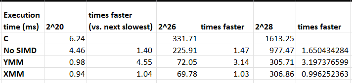

# CEPARCO Deep Dive: SIMD programming project

## Table of Execution Times

### Result Analysis

The execution times across these implementations reveal a clear performance hierarchy driven by parallelism and memory management overhead. The slowest baseline is Serial C, which is significantly improved by basic compiler optimizations. The introduction of SIMD Vectorization provides a massive speedup by processing 4 to 8 floating-point numbers simultaneously on the CPU. However, the very minimal change in performance between XMM and YMM suggests the CPU implementation becomes memory-bound—the CPU is waiting for data more than it's executing arithmetic.

The shift to the GPU delivers the most dramatic gains, with the highly optimized CUDA classic MEMCPY achieving the fastest time. This showcases the immense power of the GPU's thousands of threads, which easily outweighs the overhead of two explicit memory transfers (Host to Device and Device to Host). In contrast, the unoptimized CUDA implementation is significantly slower. This high overhead is primarily due to page-faulting the GPU incurring latency as it fetches data pages on demand from the CPU memory upon first access, this is fixed by the mor eoptimized implementations, shown by the fact that not only is the kernal time significantly faster, the transfer time from Host to Device is also not included with the total execution time.

The data demonstrates that Unified Memory requires explicit optimization to be competitive. Simply using CUDA Prefetch reduces the time by eliminating runtime page faults, and the combination of Prefetch, page creation, and memadvise further lowers the time to ~ ms. This optimized Unified Memory performance is almost identical to the Classic MemCopy method, confirming that memory management overhead can be minimized with fine-grained control. Finally, Data initialization in a CUDA kernel is inefficient  suggesting that the overhead of using the GPU's Random Number Generator (or parallel initialization) is significantly greater than simply having the CPU initialize the data and then transferring it via cudaMemcpy.

## Problems encountered

## Screenshots

The following screenshots include average execution times over 30 runs as well as the correctness checks.

### $2^{20}$

### $2^{26}$

### $2^{28}$

### SIMD boundary test

