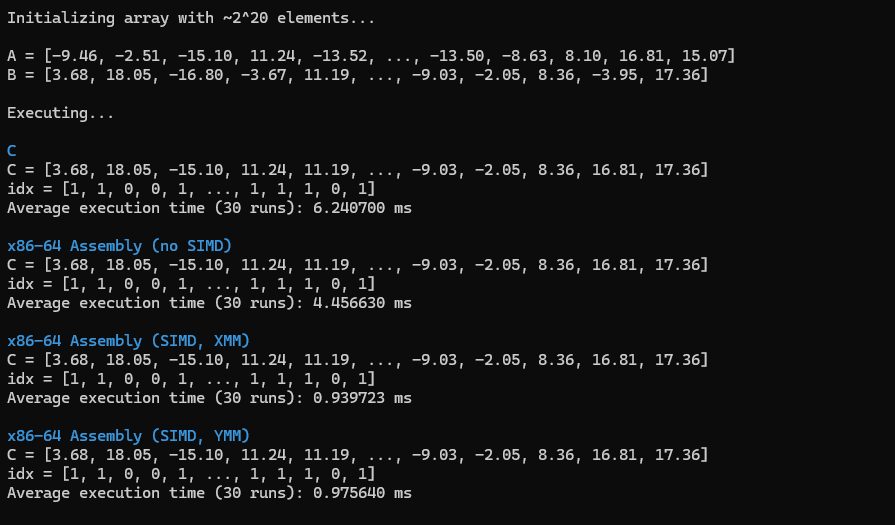
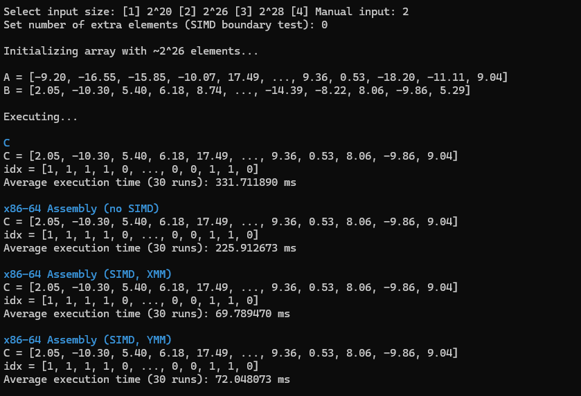
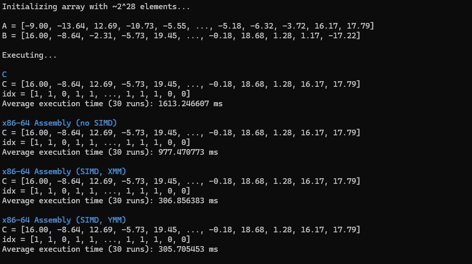
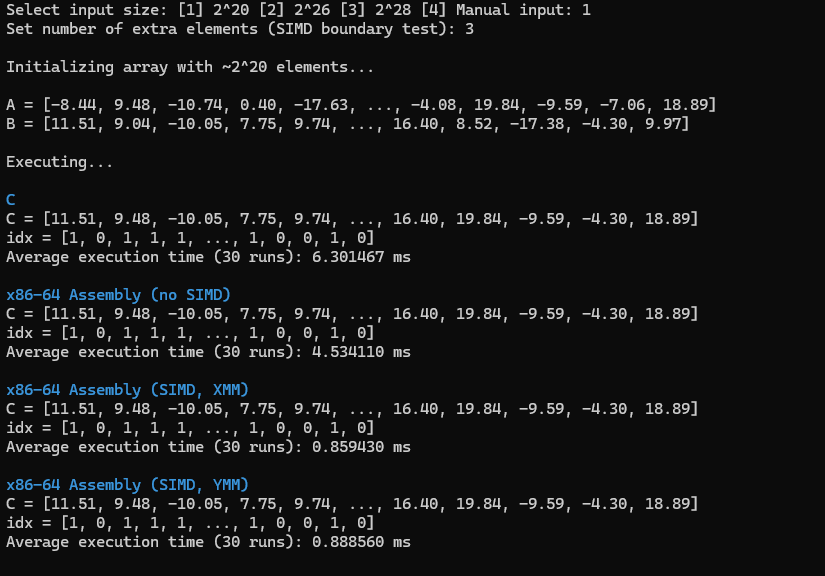
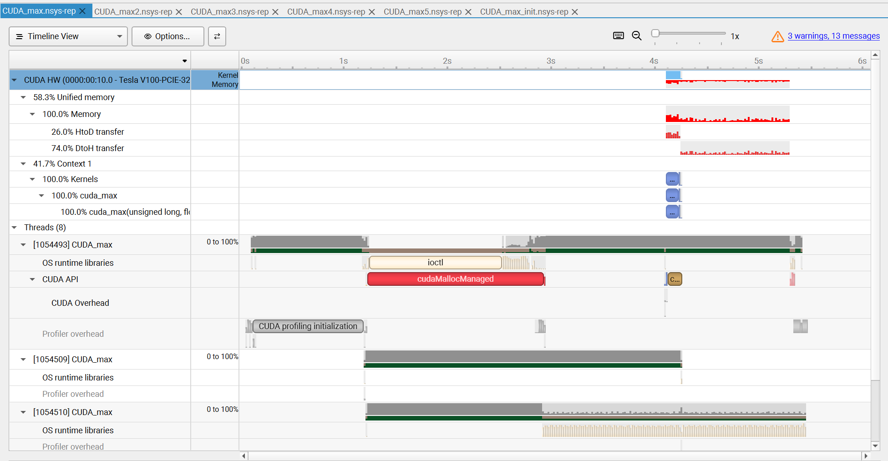
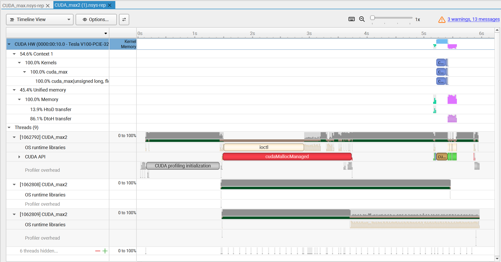
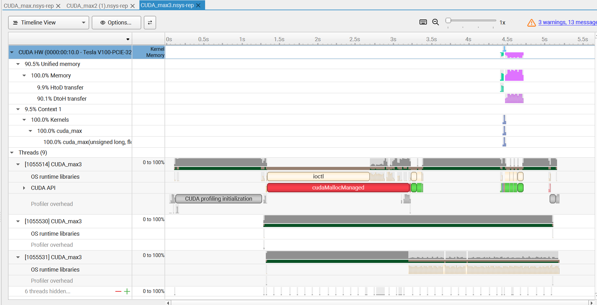
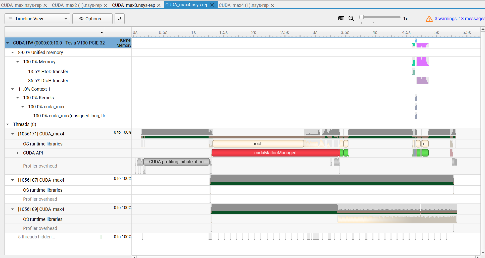
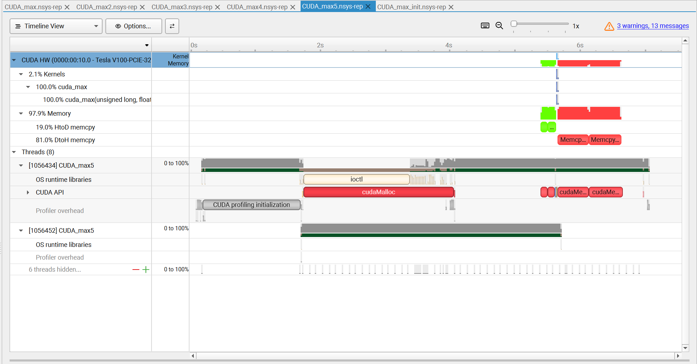

# CEPARCO Deep Dive: CUDA programming project

## Performance analysis

| :--- | :--- | :--- |
| x86-64 | 349.7 | |
| X86-64 SIMD XMM | | |
| x86-64 SIMD YMM | | |
| CUDA Unified | | |
| CUDA Prefetch | | |
| CUDA Prefetch+page creation | | |
| CUDA Prefetch+Page creitition+memadvise | | |
| CUDA classic MEMCPY | | |
| CUDA data init in a CUDA kernel | | |

For C and AVX kernels, they were timed from the start of their function's execution until they returned. For all implementations except grid-stride loop, the total host-to-device transfer time is not included in the final estimate of the overall execution time as the data has already been prefetched and transferred into the GPU by the time the kernel is executed. This can be viewed in the Nsight Systems reports; for these implementations, **no further host-to-device transfers occur during and after the period in which the kernel is executed ten times**. Classic MEMCPY required hefty host-to-device and device-to-host transfers, while initializing the array within the CUDA device meant that we only needed to transfer from the device to the host *after* the program's execution.

## Observations (SIMD)

### C implementation

The C implementation was a basic if/else branch inside a for loop. The program will linearly go through each pair of elements in the arrays and compare them directly; `C[i]` gets whichever is higher and `idx[i]` gets zero if `A[i] >= B[i]`. As expected, this was the **worst-performing** implementation, as this linear performance compounded with the additional overhead of the C language.

### x86-64 assembly implementation (no SIMD)

The x86-64 assembly implementation without SIMD was fundamentally very similar to the C implementation and thus shares its linear performance, as it still checks every pair of elements in order. It performed slightly better than C, as it did not have the aforementioned program overhead.

### x86-64 assembly implementation (XMM)

The x86-64 assembly implementation using XMM registers performed much better than the non-SIMD implementation. Here, the program goes through four elements at a time instead of one. The `VMAXPS` instruction efficiently stores the max elements in its two operand vectors into a destination vector, in this case `XMM0`. Then, we opted to use the `VCMPPS` instruction with a predicate of `0` to compare this new vector with the `B` vector to implement the behavior when checking for `A[i] >= B[i]`.

In cases where the input vector size is not a multiple of 4, allowing the SIMD implementations to keep going will result in writing to memory that is out of bounds, which *may* cause unpredictable behavior. This was addressed with a simple solution: when there are less than four elements remaining, the program switches to the SIMD-less implementation for the remaining elements (that is, performing a linear search).

### x86-64 assembly implementation (YMM)

The x86-64 assembly implementation using YMM registers, in all cases, performed very closely to the XMM implementation, but **slightly worse**. YMM **theoretically** offers twice the throughput as the XMM approach, as YMM can hold eight single-precision values as opposed to four. However, numerous possible explanations exist for why the YMM approach may have been slower, e.g. [additional latency introduced by the higher-order 128 bits in 256-bit register-to-register transfers](https://stackoverflow.com/a/60173277). This is likely processor-dependent, and may not be the case for all machines. Note that the YMM implementation used the same handling of boundary cases as with the XMM implementation, but with 8 instead of 4.

## Observations (CUDA)

### SIMD and SIMT

SIMD (single instruction, multiple *data*) and SIMT (single instruction, multiple *threads*) are two forms of data parallelism. AVX instructions are an example of the former, while CUDA is an example of the latter. The key difference between the two is that AVX makes use only of a single thread with multiple data paths to handle multiple data at a time. On the other hand, CUDA makes use of multiple threads to accomplish a similar task. For cases such as this one, where the data is highly structured and the operation performed is basic (arithmetic), CUDA may be overkill and SIMD solutions may be preferred, especially when power efficiency is of concern. Solutions such as CUDA shine when, among other reasons, (1) power efficiency is irrelevant, (2) data might be more *complex* in structure, as threads could be more flexible with how they handle multiple data (with the caveat that a basic grid-stride loop like demonstrated here might no longer be applicable in such cases).

### Prefetching

From an intuitive standpoint, prefetching might only be truly beneficial for tasks where the GPU is often idle and waiting for data. In cases where the execution time bottleneck is instead computational speed (that is, for very complex tasks), prefetching will likely be not as effective and in extreme cases might only introduce additional overhead to the program; allowing CUDA to manage its own memory might be better in such cases. Another thing to consider might be the memory (VRAM) available on the device in the first place, as if working with a lower-end device attempting to prefetch all your data ahead of time might "clog" up the device and potentially impede other data transfers. For this project, however, prefetching appears to have been strictly beneficial.

## Problems encountered

### SIMD boundary conditions

One of the encountered problems is the overwriting of memory outside of the intended arrays and variables of the program. Although our original implementation of SIMD ensures that the "boundary" elements are included, memory outside of these "boundary" elements may be written into since SIMD instructions assume they perform operations on memory that is either 128 bits wide for XMM registers of 256 bits wide for YMM registers. When performing operations on boundary elements that take up less total space than 128 or 256 bits, the surrounding memory is also altered. Visual Studio also returned warnings when this occurred. Thus, to account for this, we adapted the individual placement of values from the non-SIMD implementation for the final few "boundary" elements to ensure memory safety.

### `cudaMemcpy()`

It was a bit difficult to implement classic `cudaMemcpy()` as it was not covered in class. However, the basic idea was very simple --- allocate memory on the host and device and manually transfer data between the two as needed.

### Random number generation on CUDA device

When initializing the arrays on the CUDA device, we (obviously) lose access to host library functions, such as the C standard library's `rand()` function. As there was no easy alternative without having to bloat our program with extra dependencies (CUDA has specific random number libraries), we opted to simply use a value of `i` and `i * 2` for `A` and `B` respectively. This appeared to be okay as doing so did not diminish the goal of the program, which was to measure performance.

## Screenshots

### $2^{20}$

### $2^{26}$

### $2^{28}$

### SIMD boundary test

### GSL

### GSL + PF

### GSL + PF + PC

### GSL + PF + PC + MA

### MEMCPY

### INIT

